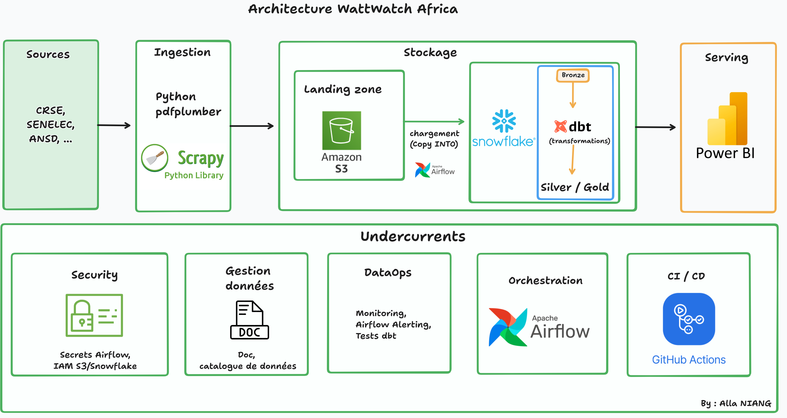

# WattWatch Africa ⚡

**Observatoire de l'affordabilité énergétique en Afrique de l'Ouest**

Pipeline data engineering complet qui collecte les grilles tarifaires électriques du Sénégal
(et à terme d'autres pays africains), les normalise, calcule des indicateurs d'affordabilité
et permet des comparaisons régionales.


## Architecture

Flux ELT en 4 étapes + 5 undercurrents transverses (modèle *Fundamentals of Data Engineering*,
Reis & Housley) :



- **Ingestion** : Scrapy (API REST WordPress de crse.sn, pages HTML) + pdfplumber (grilles tarifaires PDF)
- **Landing zone** : AWS S3, dépôt brut des fichiers scrapés
- **Chargement** : `COPY INTO` orchestré par Airflow, S3 → Snowflake (Bronze)
- **Transformation** : dbt, exécuté entièrement dans Snowflake (Bronze → Silver → Gold)
- **Serving** : Power BI
- **Orchestration** : Apache Airflow · **CI/CD** : GitHub Actions

## Statut — Phase 0 (POC) ✅

La preuve de bout en bout est faite sur la source principale :

1. **Découverte** — crse.sn expose ses documents via l'API REST WordPress
   (`/wp-json/wp/v2/crse_document`, ~530 documents, dont la catégorie `grilles-tarifaires`).
2. **Ingestion** — le spider `crse` pagine l'API, filtre par catégorie/secteur et télécharge
   les PDF (throttling actif : le site renvoie des 503 en cas de requêtes rapides).
3. **Parsing** — `pdf_parser.py` extrait de la grille SENELEC du 1er janvier 2026
   (celle de la baisse de 10 %) : tarifs BT par tranche, prépaiement Woyofal, MT/HT
   heures pointe/hors-pointe, primes fixes et bornes des tranches — en format *tidy*.

## Démarrage rapide

```bash
python -m venv .venv
.venv\Scripts\activate        # Windows
pip install -r requirements.txt

# 1. Scraper les grilles tarifaires CRSE (PDF → data/landing/crse/)
scrapy crawl crse -a cats=grilles-tarifaires -O data/landing/crse/manifest.json

# 2. Parser une grille en CSV tidy
python -m scrapers.pdf_parser data/landing/crse/full/<fichier>.pdf -o data/processed/

# Tests
pytest
```

Pour pousser la landing zone vers S3, définir dans `.env` (voir `.env.example`) :
`AWS_ACCESS_KEY_ID`, `AWS_SECRET_ACCESS_KEY`, `WATTWATCH_S3_BUCKET` — le spider écrit alors
directement `FILES_STORE=s3://…`.

## Tester le pipeline complet avec Docker

La stack locale dockerise tout ce qui peut l'être : **Airflow** (webserver + scheduler +
Postgres, LocalExecutor) et **MinIO** qui émule la landing zone S3. Snowflake et Power BI
restent des services externes.

```bash
docker compose up -d --build
```

| Service | URL | Identifiants |
|---|---|---|
| Airflow UI | http://localhost:8080 | admin / admin |
| Console MinIO | http://localhost:9001 | minioadmin / minioadmin |

Le repo est monté sur `/opt/wattwatch` dans les conteneurs : toute modification de code ou
de DAG est prise en compte sans rebuild. Dans ce mode, le spider écrit ses PDF dans
`s3://wattwatch/landing/crse/` (MinIO) et `scrapers/process_landing.py` les parse vers
`s3://wattwatch/processed/` — exactement le contrat qu'aura le vrai S3.

Tester un DAG sans attendre le scheduler :

```bash
docker compose exec airflow-scheduler airflow dags test wattwatch_ingestion 2026-07-17
```

Les DAGs `wattwatch_load` (COPY INTO) et `wattwatch_dbt` s'activent en renseignant
`AIRFLOW_CONN_SNOWFLAKE_WATTWATCH` dans `.env` (compte d'essai Snowflake suffisant).
Note : Snowflake ne peut pas lire un MinIO local — pour le `COPY INTO`, pointer
`WATTWATCH_S3_BUCKET` vers un vrai bucket S3 (il suffit de changer les variables
d'environnement, aucun changement de code).

## Structure

```
wattwatch-africa/
├── scrapers/          # Spiders Scrapy + parseur PDF (package Scrapy)
├── dags/              # DAGs Airflow : ingestion → chargement → dbt
├── dbt/               # Modèles Bronze/Silver/Gold + tests
├── tests/             # pytest (fixtures : vraie grille SENELEC 2026)
├── data/              # landing/ (brut, non versionné) et processed/
├── .github/workflows/ # CI : lint + tests Python, dbt parse
└── docs/
```

## Indicateurs d'affordabilité (couche Gold, Phase 2)

- Coût unitaire par kWh et par tranche
- Part du revenu des ménages pour un panier électrique de base (seuil ESMAP ~5-10 %)
- Équivalent en kWh du salaire minimum (SMIG)
- Indice de progressivité tarifaire (1ère tranche vs suivantes)
- Écart prépaiement (Woyofal) vs post-paiement
- Prix normalisé en USD PPP (comparaison inter-pays)
- Indice d'évolution temporelle (base 100) — capte la baisse de 10 % du 1er janvier 2026
- Croisement prix × taux d'accès à l'électricité (World Bank `EG.ELC.ACCS.ZS`)

## Sources de données

| Source | Apport | Format |
|---|---|---|
| [CRSE](https://www.crse.sn) | Grilles tarifaires officielles, décisions | PDF (API REST WP) |
| [SENELEC](https://www.senelec.sn) | Communiqués, grilles complémentaires | HTML |
| ANSD | Revenu des ménages, pauvreté | CSV |
| World Bank Open Data | Taux d'accès à l'électricité (SDG7) | API |
| Africa Energy Portal, ANARE-CI/CIE | Extension régionale (Phase 4) | Web/PDF |
